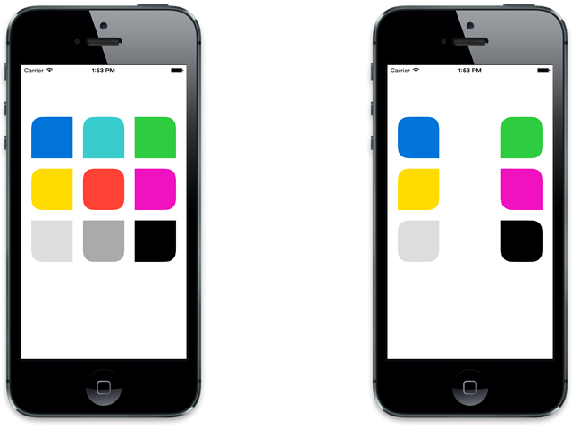

# TiCornerRadius

Inspired by [iphone - how to set cornerRadius for only top-left and top-right corner of a UIView? - Stack Overflow](http://stackoverflow.com/a/13163693). for Titanium app.



## Install

[Compiled module download](be.k0suke.ticornerradius-iphone-0.1.zip)

## Usage

You can see screenshot's example at [example/app.js](example/app.js).

```javascript
var TiCornerRadius = require('be.k0suke.ticornerradius');
var view = Ti.UI.createView({
	width: 80,
	height: 80,
	backgroundColor: '#000',
	cornerRadius: {
		corners: TiCornerRadius.CORNER_TOP_LEFT | TiCornerRadius.CORNER_TOP_RIGHT,
		radii: {
			width: 20,
			height: 20
		}
	}
});
```

### Properties

* cornerRadius.corners / CORNER_TOP_LEFT or CORNER_TOP_RIGHT or CORNER_BOTTOM_LEFT / CORNER_BOTTOM_RIGHT / CORNER_ALL_CORNERS
* cornerRadius.radii.width / height

## License

The MIT License (MIT) Copyright (c) 2014 Kosuke Isobe